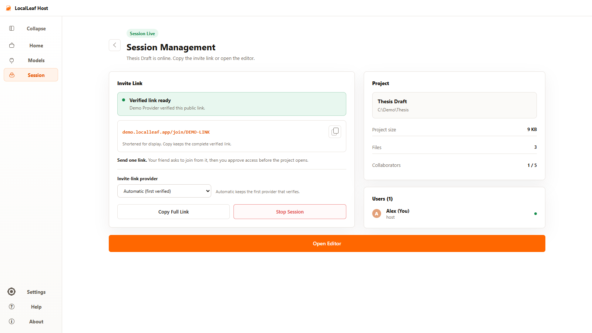
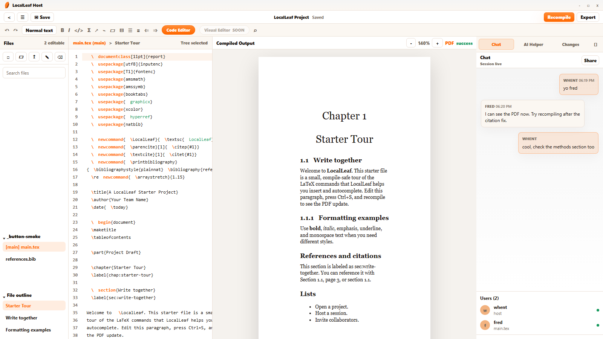
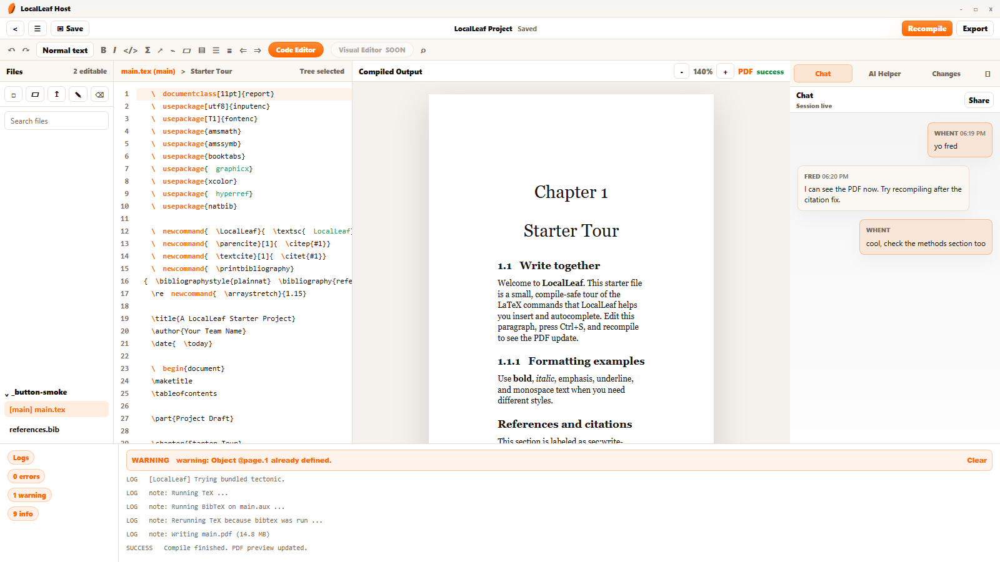
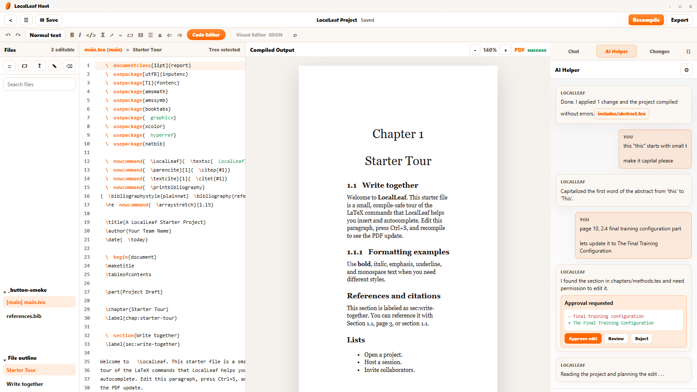
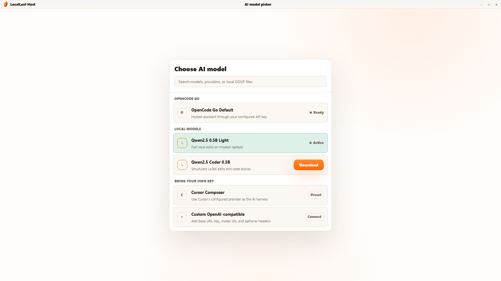
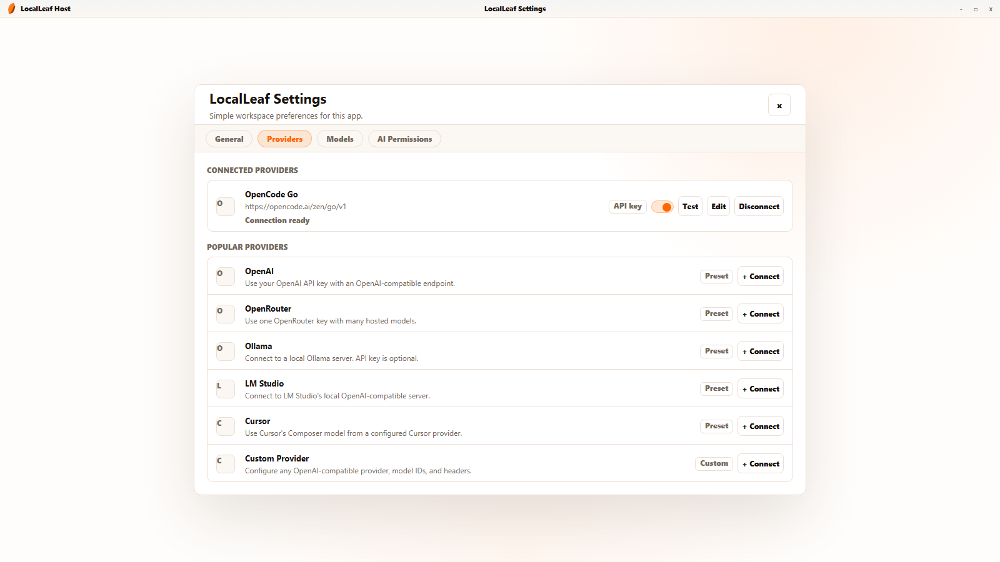

# LocalLeaf

<p align="center">
  
</p>

<h3 align="center">The Overleaf-like editor hosted by you.</h3>

<p align="center">
  Open a LaTeX project, share a temporary link, approve collaborators, write together, compile locally, and keep the files on the host computer.
</p>

<p align="center">
  <a href="https://sethwhenton.github.io/localleaf/"><strong>Website</strong></a>
  |
  <a href="https://github.com/sethwhenton/localleaf/releases/latest"><strong>Latest release</strong></a>
  |
  <a href="docs/latex-setup.md"><strong>LaTeX setup</strong></a>
  |
  <a href="docs/packaging.md"><strong>Packaging notes</strong></a>
</p>

<p align="center">
  <a href="https://github.com/sethwhenton/localleaf/releases/latest/download/LocalLeaf-Host-Setup.exe">Download for Windows</a>
  |
  <a href="https://github.com/sethwhenton/localleaf/releases/latest/download/LocalLeaf-Host-mac-arm64.dmg">Mac Apple Silicon</a>
  |
  <a href="https://github.com/sethwhenton/localleaf/releases/latest/download/LocalLeaf-Host-mac-x64.dmg">Mac Intel</a>
</p>

<p align="center">
  <picture>
    <source media="(prefers-color-scheme: dark)" srcset="landing-page/assets/session-management-dark.png">
    
  </picture>
</p>

## What It Is

LocalLeaf is a host-powered LaTeX collaboration app. The host runs the desktop app, opens a project, starts a session, and shares an invite link. Collaborators join from a browser to edit and chat; the host compiles the shared PDF, and approved collaborators can preview or export it while the host computer remains the source of truth.

No accounts. No monthly server. No cloud storage.

When the host stops the session or closes the app, the room ends and the project stays on the host machine.

## Highlights

- Host-controlled desktop app for Windows and macOS.
- Browser-based collaborators through temporary invite links.
- Secure tunnel flow so collaborators can reach the host without renting a server.
- Real LaTeX project import from folders or ZIP files.
- CodeMirror 6 LaTeX editor with line numbers, highlighting, toolbar actions, shortcuts, and autocomplete.
- Local PDF compilation through bundled Tectonic, system LaTeX tools, or fallback preview guidance.
- PDF.js preview with zoom, page preservation, export support, and per-participant click-to-source navigation through SyncTeX.
- Real-time shared text editing over WebSockets.
- Human chat beside the editor, PDF preview, compile logs, and project files.
- AI Helper with local models, OpenAI-compatible providers, safe rich Markdown, natural prose guidance, approval cards, and reviewable file edits.
- Light and dark app themes.

## Preview

### Write With People

<picture>
  <source media="(prefers-color-scheme: dark)" srcset="landing-page/assets/editor-human-chat-dark.png">
  
</picture>

The editor keeps project files, LaTeX source, PDF preview, and chat in one workspace so groups do not have to split work across a separate chat app and a separate editor.

### Compile Locally

<picture>
  <source media="(prefers-color-scheme: dark)" srcset="landing-page/assets/editor-compile-logs-dark.png">
  
</picture>

The host compiles the project locally, serves the latest PDF preview, and keeps logs visible for quick fixes.

## AI Helper

LocalLeaf includes an AI Helper designed for LaTeX work, not a general chatbot bolted onto the side. It can read project context, explain compile errors, suggest edits, and ask before changing files.

<picture>
  <source media="(prefers-color-scheme: dark)" srcset="landing-page/assets/editor-ai-helper-dark.png">
  
</picture>

AI work is built around review:

- The model can propose safe text edits.
- LocalLeaf shows approval cards before writes.
- Accepted edits are tracked in Changes.
- File edits stay project-contained and text-only by default.
- YOLO mode exists for trusted local flows, but the normal path is approval first.

### Local Models Or Your Own Key

<picture>
  <source media="(prefers-color-scheme: dark)" srcset="landing-page/assets/model-picker-popup-dark.png">
  
</picture>

You can download supported GGUF models and run them locally on the host computer, or connect an OpenAI-compatible provider with your own key.

<picture>
  <source media="(prefers-color-scheme: dark)" srcset="landing-page/assets/ai-providers-settings-dark.png">
  
</picture>

The built-in Cursor-style harness powers AI edit proposals inside LocalLeaf: model requests, tool context, approval cards, diffs, and safe apply/reject actions all stay inside the app.

## How A Session Works

1. The host installs and opens LocalLeaf Host.
2. The host creates, opens, or imports a LaTeX project.
3. The host starts an online session.
4. LocalLeaf starts the local server, compiler, collaboration socket, and public tunnel.
5. Collaborators open the invite link in a browser.
6. The host approves people as they join.
7. Everyone writes together against the host-owned project.
8. The host compiles and serves the latest PDF preview.
9. When the host stops the session, guests disconnect gracefully.

## Downloads

| Platform | Download |
| --- | --- |
| Windows 10 / 11 | [LocalLeaf-Host-Setup.exe](https://github.com/sethwhenton/localleaf/releases/latest/download/LocalLeaf-Host-Setup.exe) |
| macOS Apple Silicon | [LocalLeaf-Host-mac-arm64.dmg](https://github.com/sethwhenton/localleaf/releases/latest/download/LocalLeaf-Host-mac-arm64.dmg) |
| macOS Intel | [LocalLeaf-Host-mac-x64.dmg](https://github.com/sethwhenton/localleaf/releases/latest/download/LocalLeaf-Host-mac-x64.dmg) |

Current release: `0.1.25`

Version `0.1.25` adds explicit Viewer and Maintainer guest controls, stronger live-session authorization, detailed Help and About guidance, smoother desktop interactions, provider-aware AI context handling, and broader rendered and security regression coverage.

## macOS First Launch

The macOS builds are currently unsigned and not notarized because this project does not yet have Apple Developer Program enrollment. macOS Gatekeeper may block the first launch even when the DMG was downloaded from the official GitHub release.

To open LocalLeaf on macOS:

1. Download the correct DMG for your Mac: Apple Silicon or Intel.
2. Open the DMG and drag `LocalLeaf Host.app` into `Applications`.
3. In `Applications`, Control-click or right-click `LocalLeaf Host.app`.
4. Choose `Open`.
5. Choose `Open` again in the macOS warning dialog.

If macOS still blocks the app:

1. Open `System Settings`.
2. Go to `Privacy & Security`.
3. Scroll to `Security`.
4. Choose `Open Anyway` for `LocalLeaf Host`.

Advanced fallback, only if you trust the DMG you downloaded from this repository:

```bash
xattr -dr com.apple.quarantine "/Applications/LocalLeaf Host.app"
```

Then open the app again from `Applications`.

## Run Locally

Install dependencies from the lockfile. This repo disables dependency lifecycle scripts by default, so rebuild only the known packages that need native/binary setup:

```powershell
npm ci --ignore-scripts
npm rebuild electron esbuild --ignore-scripts=false
```

On Windows, also rebuild the Windows installer helper before packaging:

```powershell
npm rebuild electron-winstaller --ignore-scripts=false
```

Run the server-only web app:

```powershell
npm start
```

Then open:

```text
http://localhost:4317
```

Run the desktop app in development:

```powershell
npm run dev:desktop
```

## Test

```powershell
npm test
```

The test suite builds the client bundles and runs the server, compiler, import, collaboration, tunnel, path-safety, and PDF-serving tests.

## Build Installers

Build the Windows installer:

```powershell
npm run package:win
```

Build macOS installers:

```powershell
npm run package:mac:x64
npm run package:mac:arm64
```

## Notes

- The host computer owns the project files and compile output.
- Guests do not need to install anything; they join from a browser.
- Visual Editor is marked as coming soon while the code editor is the stable editing surface.
- LocalLeaf tries `latexmk`, bundled Tectonic, system `tectonic`, `pdflatex`, `xelatex`, and `lualatex` for PDF compilation.
- If no compiler is available, LocalLeaf shows compiler guidance and a readable HTML preview fallback.
- Cloudflare Quick Tunnel is used when bundled or installed `cloudflared` is available.
- ZIP imports enforce entry-count, expanded-size, per-file-size, and nesting limits. Exports skip hidden/system folders such as dotfiles and `node_modules`.

## Docs

- [Packaging](docs/packaging.md)
- [LaTeX setup](docs/latex-setup.md)
- [Cloudflared setup](docs/cloudflared-setup.md)
